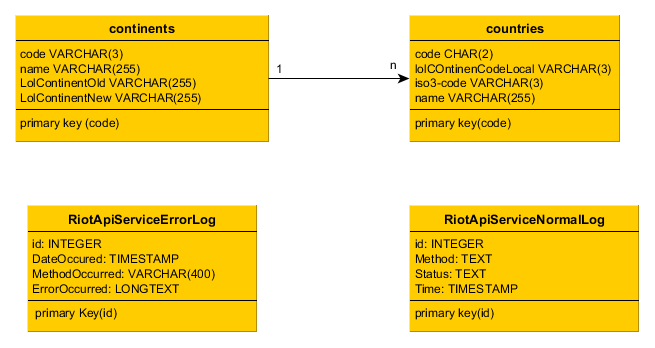

# Conception and Draft

## General Architechture
We have a server that contains a webservice and a website. The website communicates with the user
and exchanges data with the webservice. The webservice exchanges data with
the riot api, google reverse-geocoding api, google smtp-server and the MariaDB.
See the below for an illustration:

The arrows describe the flow direction of data between the different components.

## MariaDB Database
We wanted to use the MariaDB only for the mapping of countries to the
LoL-regions and to log errors and debug infos of the service. These purposes resulted
in a very simple Database structure which can be seen in the ERD below.

