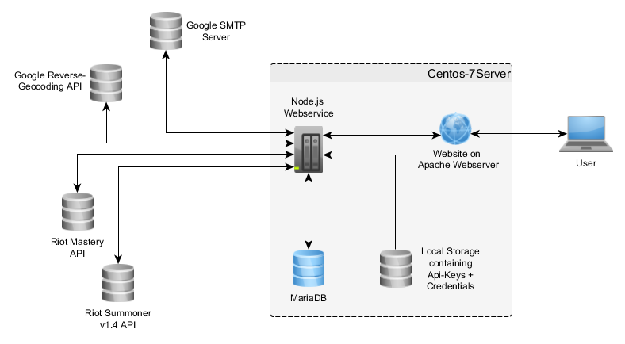

# Conception and Draft

## General Architechture
We use a server that contains a webservice and a website. The user communicates with the website
and the website exchanges data with the webservice. The webservice exchanges data with
the riot API, Google reverse geocoding API, Google SMTP-server and MariaDB.
See the below for an illustration:

The arrows describe the flow direction of data between the different components.

## MariaDB Database
We intended to use the MariaDB only for the mapping of countries to the
League of Legends-regions and to log errors and debug infos of the service. These purposes resulted
in a very simple Database structure which can be seen in the ERD below.

